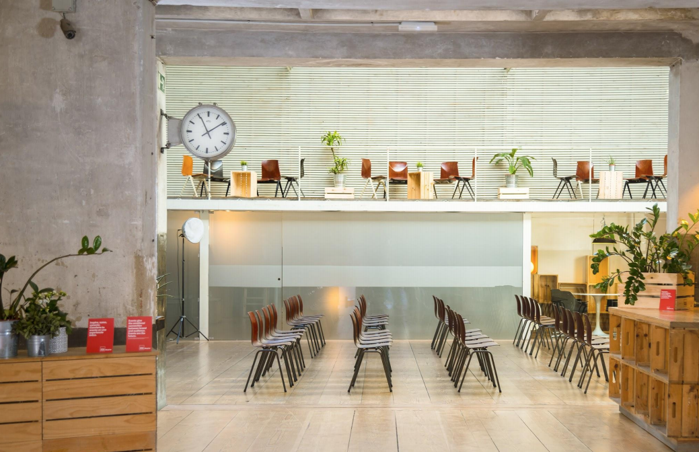

<script> 
    $(document).ready(function() { 
    $head = $('#header'); 
    $head.prepend('<A href = https://www.cuttingedge-events.com></A>') 
    }); 
</script> 

```{r setup, include=FALSE}
knitr::opts_chunk$set(echo = FALSE, message=FALSE, warning=FALSE)
```


```{r libraries}
library(readxl)
library(shiny)
library(dplyr)
library(knitr)
library(timevis)

```

<br>
<br>

# Map 

<iframe src="https://www.google.com/maps/d/embed?mid=15zJcGckD6qgiW1Dy3dSboezB4NcnhMis&hl=es" width="100%" height="500"></iframe>

<hr>

# _**Apartament Options**_

## Gran Via Capital

SmartRentalCollection Gran Vía Capital is located right in Madrid's Gran Vía, one of the most important commercial streets, close to the main point of interest such as Puerta del Sol, Plaza Mayor, Palacio Real... 

The apartments are fully furnished and equipped for you to make the most out of your stay in Madrid, and feel like at home. They also feature a 24/7 Front Desk, a seasonal pool (Open from April to October ), sauna, solarium on the rooftop, gym and parking.

**Sauna and gym pictures**


**Rooftop pictures**


All guests will be accomodated in the same building. There are three types of apartments, individual, double and triple ones. All guests will have his own room though.

  * 21x Apartments, 1 Bedroom and 1 Bathroom (1 guest)
  * 20x Apartments, 2 Bedrooms and 2 Barhrooms (2 guests)
  * 3x Apartments, 3 Bedrooms and 2 bathrooms (3 guests)

*Each guests will has his own room*


    Services:

    Air Conditioning
    Free bathroom amenities
    Private bathroom with shower
    Blender
    Coffee machine
    Safety box
    Heating
    Fridge
    Kettle
    Washing machine
    Microwave
    Iron
    Hairdryer
    Sofa-bed
    Hardwood floor
    Phone
    Towels and linen
    Toaster
    Flat screen TV with international channels
    WiFi
    
    Cleaning service included: once per week, they change the bed-sheets and the towels each week.
    
Smoking is prohibited and pets are not allowed

There is no bar or restaurant in the building.


### Types of apartments {.tabset .tabset-fade}

#### 1 Bedroom

These apartments have a bedroom with a double bed, a fully equipperd kitchen, bathroom and a living room with a double sofa-bed. All of them have a distinguished deciration but in different styles.


<br>
<hr>

#### 2 Bedrooms

These two bedroom apartments have two bedrooms (either with two double beds or one double bed and two single beds), a fully equipped kitchen, two bathrooms and a double sofa-bed.


<br>
<hr>

#### 3 Bedrooms

These three bedroom apartments have three rooms (two with a double bed, and one with two single beds), a fully equipped kitchen, two bathrooms and a double sofa-bed.


<br>
<hr>

### Terms and conditions

PAYMENT CONDITIONS:

  * 40% to confirm the booking
  * 60% 60 days before the group arrival
  
TOTAL CANCELLATION:

  * From the confirmation to 61 days prior the group arrival - first deposit lost
  * From 60 days prior the group arrival - 100% lost.
  
*They say that there are no partial cancellations - we are still negotiating better conditions...*

<br>
<br>
<hr>

## Eric Vökel Apartments

Eric Vökel Madrid suites and Eric vökel Atocha suites are both two apartments buildings located in Madrid. These apartments belongs to a  company hosted in different European countries. They feature a high standing apartment complex.
All 70 guests will be distributed in both buildings, which are 20 minutes by walk/ 10 minutes by car each other. 

Rates include:
* Reception care service from 09:00-18:00
* WiFi
* Keys for all guests (card format)
* Water and electricity
* Apartment instalations: kitchen, fridge, ovan, washing machine, all the stuff needed to cook, dishwasher, usual cleaning material (broom, mop...)
* All common zones: Terrace on the athic, Climatized pool on the low level, parking, Eric's corner (free coffee, tea,, oil, etc)
* Towels
* Cleaning each 3 days

Rates doesen't include:
* Bar (neither bar nor restaurant available on the building)

<br>
**Each guests will have his own room, but the bathrooms will be shared with all guests in the apartment (1 bathroom or 2, depending on the apartment)**

<br>

#### **Eric Vökel Madrid suites**

Located in San Bernardo street, Eric Vökel Madrid Suites is a gorgeous and incredibly refurbished property which includes beautiful apartments. Located in the heart of the Malasaña district, next to the Gran Vía, it allows guests to experience and enjoy a more pure, authentic Madrid. This central district, now the height of fashion, has great public transportation links that make it incredibly easy to get to any point of the city.

The building is also just a ten minute walk from the Puerta del Sol, Plaza de España and the Prado Museum.

Eric Vökel Madrid suites features capacity up to 44 people. It has different types of rooms:

* 8x Apartments, 2 Bedrooms + 1 bed-sofa, 1 Bathroom (2 guests per apartment)
* 9x Apartments, 2 Bedrooms + 1 bed-sofa, 2 Bathrooms (2 guests per apartment) 
* 2x Attic apartments, 2 Bedrooms + 1 bed-sofa, 1 Bathroom (2 guests per apartment)
* 1x Apartment, 3 Bedrooms + 1 bed-sofa, 2 Bathrooms (3 guests)
* 1x Attic apartment, 3 Bedrooms + 1 bed-sofa, 2 Bathrooms (3 guests)

* *Each guest will has his own room*


<br>

#### **Eric Vökel Atocha suites**

Located in Calle Vizcaya, Eric Vökel Atocha suites were completely refurbished in 2013, stand out thanks to their unique location. They are located right at center of the Golden Triangle of Art, just a few minutes away from the Prado Museum, the Reina Sofía museum and the Retiro Park. 

Additionally, the Atocha metro station makes sure that guests are connected to every place of this fantastic city: the Plaza Mayor, the Puerta del Sol, the Gran Vía. And on top of that, the property offers free Jacuzzi and parking access.

Eric Vökel Atocha suites features capacity up to 35 people. As well as Eric Vökel Madrid suites It has different types of rooms:

* 8x Apartments, 1 Bedroom + 1 bed sofa, 1 Bathroom (individual apartment)
* 5x Apartments, 1 Bedroom + 1 bed-sofa, 1 Bathroom, terrace (individual apartment)
* 3x Apartments, 2 Bedrooms + 1 bed-sofa, 1 Bathrooms (2 guests)
* 8x Apartment, 2 Bedrooms + 1 bed-sofa, 2 Bathrooms (2 guests)

* *Each guest will has his own room*


### Terms and conditions

PAYMENT CONDITIONS:

  * 50% to confirm the booking
  * 25% to be paid before December 3rd, 2019
  * 25% to be paid before January 10th, 2020
  
TOTAL/PARTIAL CANCELLATION:

  * From the confirmation until December 2nd - you can cancel a 50% of the confirmed services.
  * From December 3rd, 2019 to January 9th, 2020 - you can cancel a 25% of the confirmed services.
  * From January 10th - Eric Vokel will charge the 100% of the confirmed services.


# Working Spaces {.tabset .tabset-fade .tabset-pills}

## Utopicus {.tabset .tabset-fade}

Utopicus is a company that has different nice and modern buildings that offer a lot of services to work confortable.

  * Prime spaces with reception, surveillance and latest technologies.
  * Workstations fix with furniture in a private office.
  * 24x7 access.
  * High availability Internet by Fiber optic and advanced WiFi.
  * Possibility of installing equipment in dedicated rack.
  * Liability insurance in common areas.
  * Tax residence.
  * Use of common areas.
  * Networking and weekly programming of contents: breakfasts, afterworks...
  * Organic coffee and tea & purified water. Fresh fruit every morning.
  * Reception of courier and parcel service.
  * 140 hours use meeting rooms

### Gran Via


This building is located 10 minutes from Smart Collection aparments but **guests would be separated in different offices in different floors**. They will be all in the same building shared the common spaces but in this co-working the can't have a whole working space to fit the 70 pax.


Sample Floor plan 


### Jose Abascal

This is a new building that the company will open in December 2019. 

Our group will be in the same floor. 


Sample Floor plan


## Impacthub Prosperidad

Impacthub is a co-working company, they have 5 buildings in Madrid and in January 2020 they will open a new one: **ImpactHub Prosperidad**

It is an industrial buildind totally renewed where you can find spacious work-spaces, small and private offices, shared chill-out areas, a shared kitchen (with microwave, fridge, coffee machine, etc)

Our group will have:

  * A work space (furniture included) in exclusive for them and access to the shared areas
  * Access 24/7
  * 80 hours of free rental of small meeting rooms (until 6 pax) in any of the 6 ImpactHub buildings (under availability)
  * App to book a meetingroom 
  * WIFI
  * Security and cleaning services 

The pictures below are from the ImpactHub Picasso, but ImpactHub Prosperidad will have a similar atmosphere.


 



<br>


## Espacio Muelle 36

<iframe src="Muelle36/muellefotos.html"  frameborder="0" width="100%" height="900" scrolling="no"></iframe>
<br>

It is including WIFI connection, 50 folding chairs (orange ones in the picture), 5 folding tables (183x75cm) and 3 coat hangers

To make this space comfortable and useful we would recommend to rent funiture as the following:

    * 4 sofas
    * 20 boards (2x0,6m) with 40 sawhorses
    * 40 office chairs (with wheels)
    * 30 office chairs (with-out wheels)
    * 2 coffee makers "Dolce Gusto"
    Estimated Rental cost + transportation + setup +  dismantling: 15000€ VAT INC
  

 


 

<br>


## Palacio Santa Barbara

This venue is located just 15 minutes walking from Gran Via Capital and it is a small palace from the XIX century.
It has a in total 450m2 distributed in 6 rooms all of them with natural light.

On the ground floor has 4 rooms - between 35 and 41m2 and the first floor has 3 more: the main room with 85m2 and 2 smaller ones of 35 and 41m2.  

In spite of nit having a big room for the whole group, they can use all the first floor as office and the ground floor could be 3 meeting rooms + 1 kitchen/ chillout area.

It also has a big garden, the whole building would be in exclusive for our group but they opening hours would be from 8.00h to 00.00h

*We would need to rent or buy all the furtinure*

 

 

 

 

 

<br>


## La Grada

La Grada is a very flexible venue. It has a total of 450m2 - 1 big room of 255m2 that can be split in 2 or in 3 with accoustic courtines + a smaller area next to the kitchen that can be used as chill-out area.

Separate froom the main room there is another 50m2 room that can be used as meeting room.

The main room has daylight that comes from the big skylights.

*We would need to rent or buy all the furtinure*

 

 

 

 

<br>


## Espacio Harley Las ventas

This is a huge venue divided in twoo floors with 1000m2 per floor.
In the ground floor we can find 3 rooms and a cafeteria and in the upper room we find the main space (Harley room), Hall, kitchen, backstage room and toiltes

 

 

 

 

 

 

*We would need to rent or buy all the furtinure*


****


# Restaurant Options {.tabset .tabset-fade .tabset-pills}

## Ana La Santa {.tabset .tabset-fade }

<iframe src="AnaLaSanta/AnaLaSanta.html"  frameborder="0" width="100%" height="1050" scrolling="no"></iframe>

### 3 courses menu n1

    STARTERS (To share)
    Iberian ham “croquetas”
    Northern anchovies with “pan con tomate”
    Hand sliced Iberian ham and “pan con tomate”
    Avocado, tomato and red onion salad
    
    MAIN COURSE (to choose in advance)
    Sirloin steak with bernaise sauce and potato gratin
    o
    Breaded hake fillet with green salad and tartar sauce
    
    DESSERT (to choose in advance)
    Apple tarte tatin
    or
    Crème brûlée
    
    DRINKS
    RED: Marqués de Murrieta Reserva 2013 (D.O Rioja)
    WHITE: Pazo Barrantes 2016 (D.O Rías Baixas)
    (1 bottle for every 2 people) or 
    Water, Soft drink and beer / Bread /Coffee 
    
    Rates per person: 71€ VAT inc
    
    
<br>
    
### Tapas menu 1

    (To share)
    Iberian ham “croquetas”
    Padron peppers
    Tuna sashimi, chipotle mayonnaise, and avocado on corn tortillas
    Grilled green asparagus with Romesco sauce
    Spanish omelet with “pan con tomate”
    Marinated dogfish
    “Marinera” mussels style
    Carpaccio toast with Cipriani sauce
    Diced vegetable salad with tuna belly (Russian salad)

    DESSERT (To choose in advance)
    Chocolate brownie with vanilla ice cream
    Or
    Fresh pineapple with lime and mint
    
    DRINKS
    RED: Marqués de Murrieta Reserva 2013 (D.O Rioja)
    WHITE: Menade ECO 2016 (D.O. Rueda)
    (1 bottle for 2 person)
    Water, Soft drink and beer/ Bread /Coffee INCLUDED

    Rates per person: 55€ VAT inc


<br>


## La Mucca del Prado {.tabset .tabset-fade }

<iframe src="LaMuccadePrado/LaMuccadePrado.html"  frameborder="0" width="100%" height="1050" scrolling="no"></iframe>

### Tapas menu 1

    To Share
    Ham croquettes (1 unit per pax)
    Chicken wings
    Tuna Mille-Feuille
    Nachos 
    Sauteed Prawns
    Boletus pizza
    Thai Curry Chicken
    
    Dessert tasting
    
    Drinks:
    1 bottle of wine each 2 pax (Tempranillo and Verdejo)
    water (each bottle of wine can be changed per 2l of beer or 4 soft-drinks )
    Coffee
    
    Rates per person: 43€ VAT inc
    
    
### Tapas menu 2

    To Share
    Cheese and Cold cuts
    Mediterranean Salad
    Padron Peppers
    Sauteed Prawns
    Salmon Poke
    Lamb Cous-Cous
    Perica Iberica Pizza
    
    Dessert tasting
    
    Drinks:
    1 bottle of wine each 2 pax (Tempranillo and Verdejo)
    water (each bottle of wine can be changed per 2l of beer or 4 soft-drinks )
    Coffee
    
    Rates per person: 51€ VAT inc


<br>


## Habanera {.tabset .tabset-fade }

<iframe src="Habanera/Habanera.html"  frameborder="0" width="100%" height="900" scrolling="no"></iframe>


### 3 courses menu A

    Starters to share
    Creamy Iberian ham and fresh milk croquettes
    Raff tomato salad, sautéed green asparagus and parmesan slices
    Crispy duck futomaki, hoisin sauce and crispy sweet potato
    Truffled Omelette with truffle foam

    Main course to choose in advance
    Baked Turbot with potatoes and garlic
    Matured Beef loin with sweet potato purée

    Desserts to choose in advance
    Chocolate Coulant stuffed with hazelnut praline with vanilla ice-cream from Madagascar
    Nutella foam with vanilla ice-cream and “turron”

    Drinks:
    White Wine: Tarao
    (Martinez Lacuesta Winery – Verdejo – D.O Rueda)
    Red Wine: Tarao
    (Martinez Lacuesta Winery – Tempranillo – D.O Rueda)
    Coffee/Tea included

    Rates per person: 75,70€ VAT inc


### Coktail menu 1

    Standing cocktail:
    Seasonal mushrooms cream and parmesan foam
    Tuna toast with black been cream and pineapple
    Larrumba Russian salad on regañá (flat dumpling)
    Free-range chicken crispy Nem with Caesar sauce
    Salmon and sweet miso brochette
    Fried aubergines with sweet miso sauce
    Ropa Vieja´s muffin
    Iberian ham croquettes
    Mini Beef burger, caramelized onion and brie cheese
    
    Osmotized fruit brochette
    
    Drinks:
    White Wine: Tarao
    (Martinez Lacuesta Winery – Verdejo – D.O Rueda)
    Red Wine: Tarao
    (Martinez Lacuesta Winery – Tempranillo – D.O Rueda)
    Coffee/Tea included
    
    Rates per person: 62€ VAT inc


<br>


# Outside Madrid Dinner 

**Cigarral Santa Maria** 

Is a winery located in the Tajo valey, next to Toledo.
The legend explains that Carlos V used to go to this place to see all the city, the nobles from Madrid started building their summer houses in this area. 

These noble houses were used to be called "cigarral" because there were a lot of these insects (cicada) during the summer time. 
Cigarral Santa Maria is one of the most genuine ones because of its location (is the highest one) and its flora nad fauna.

The views of Toledo are wonderful from this winery and its vineyards are unique.


We would like to suggest a visit to the winery and wine tasting before dinner, this visit has a duration of 1 hour.
Then, after tasting 1 glass of wine and some cheese the group will go inside their beautiful dinning room


As Toledo is a beautiful medieval city we would highly recommend to combine a guided visit to the city with the winery visit and dinner.

Toledo is located around 1 hour from Madrid, to visit it the buses have to stop and wait outside the old city. Our English speaking guides will split the group in 2 and they will do a nice walking tour inside the city walls.


The organization would be:

  * Depart from Madrid at 15.30h
  * Toledo city Tour from 16.30h to 18.30h
  * Winery Visit and wine tasting 19.00h to 20.00h
  * Dinner 20.00h to 22.00h
  * Transfer back to Madrid 22.00h 
  
  
    RATES:
    * 50 seater bus to combine Toledo + Winery + dinner  (8h): 600€ VAT inc per bus (we will need 2)
    * 50 seater bus only for the winery + dinner (5h): 400€ VAT inc per bus (we will need 2)
    * English speaking guide (Toledo walking tour) 315€ VAT inc  per guide (we will need 2)
    * Winery visit + tasting of 1 glass of wine + some manchego cheese: 30€ per person VAT inc
    * 3 Courses menu including drinks and coffee from: 76€ VAT inc 
    
<br>

****

# Activity Suggestions {.tabset .tabset-fade .tabset-pills}

## iPad Treasure-Hunt

We will create this fully-customized activity following the client's preferences and needs. We will design a website that will include the instructions and the challenges that each team will have to pass.
We will split them in 10 teams and each team will need to choose a captain that will be in charge of the strategy.
The minimum duration of the activity will 2 hours and the maximim 4 hours, it will include public transfer cards and 1 drinks during the activity.
It can be organized during the morning or the afternoon, depending on the client's preferences.


<br>


## Tapas Tour

This tour will be a walking tour though the city centre combining the architecture and history explanations with the gastronomy tasting. We will split guests in two groups and each group will do the tour with one English speaking guide.
We will suggest two tapas bars and both groups will go to them and taste the same tapas but in different turns, they will switch the order.
They will taste 3/ 4 tapas + 1 drink in each stop and they will see the highlights of the city centre as Plaza Mayor, Puerta del Sol, Palacio Real...
This activity will have a duration of 4h including the 2 stops and it can be organized for lunch or for dinner.


<br>

## Amazonia Madrid

Amazonia is a multiadventure park located in the middle of the nature but just one hour from Madrid.


They have different adventure packages, the most basic one is **Quetzal Challenge** 
We will split them in teams and they will have to compete to achieve a goal. To win they will have to pass a track with ziplines, bridges, traps...so they will only be able to success if they work as a team. 
This chalenge has a total of 19 games, it has a duration of 2 hours.
The participants don't need to have any experience. 

It will be needed bus transportation to the park.

There is the possibility to have a picnic lunch in the same facilities.


<br>

## Carlos Saiz Karting

A Kating race is a very funny team-bulding activity. In Madrid we can find two karting facilities that belong to Carlos Sainz, one in Las Rozas and the other in Madrid, but we would need bus transportation to go to any of them.

The funniest team-building would be a **relay race**, it is a team competition.


* First they will do the **warm-up**, each member of each team will have a number - each driver will have 10 minutes and they will drive in order.

* Then they will do the **qualifying round** same structure as the warm-up, drivers will drive in the pre-asigned order and organization will record the fastest lap of each team. The position of each team for the final lap will be according the times recorded.

* **Final round** the teams will change their drivers each 15 laps.

There will be an award ceremony and the 3 first teams will recieve a medal.


They will have a 30 minutes briefing before starting the activity and 10 minutes break between each phase


Guests will enjoy of a non-alcoholic open bar during the activity.

<br>


# Budget 

<iframe src="https://200215relocationbudget.netlify.com"  frameborder="0" width="100%" height="3500" scrolling="no"></iframe>

<br>

*****

# Terms & Conditions

  * Rates valid for 2020.
  
  * Net rates for Ciceron
  
  * Cutting Edge Events management fee including in the detailed rates
  
  * VAT included. 
  
  * No reservation has been done. Availability upon request.
  
*****


